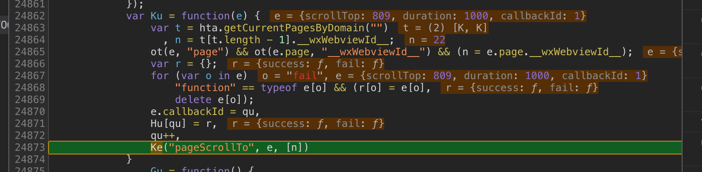

2.4.1 pageScrollTo等api进行publish没有回调参数的success和fail问题

invoke: 

  ie函数，用变量s收集fail、success等回调，供闭包函数J访问
  J函数，__safeway__.bridge.invoke(e, t, n)
    e: api名称，t: api参数，n: 闭包回调函数
  __safeway__.bridge.invoke函数，调用 WeixinJsbridge.invoke(e, t, n)
  WeixinJsbridge.invoke

publish:

  yl函数，生成__wxWebviewId__，调用ce("pageScrollTo", e, [n])
    e: api调用参数，包含success、fail回调。n: __wxWebviewId__
  ce函数，调用__safeway__.bridge.publish(r, o, a)
    r: api名称，o: api调用参数，包含success，fail回调， a: webviewid数组
  __safeway__.bridge.publish函数，调用n.send(command: 'APPSERVICE_PUBLISH', data: {eventName: e, data: o, webviewIds: s})
    e: api名称，o: api调用参数，包含success，fail回调， s: webviewid数组。s: webssocket对象
    __safeway__.bridge.publish通过214: function (e, t, o)暴露出来

对比invoke和publish调用，需要在QLogic.js生成一个闭包回调函数，传递给appSercice的publish函数，piblish函数需要为
回调函数生成一个回调id，把回调函数加入回调队列，再send给客户端。

在ce函数增加一个闭包，传递给__safeway__.bridge.publish函数，闭包可以访问参数的success、fail等回调

现网正常的publish:

wx.pageScrollTo

var Ku = function(e) 函数生成callbackid

